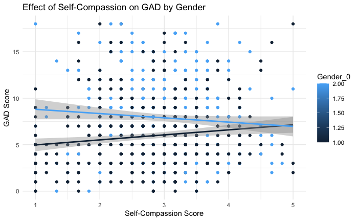
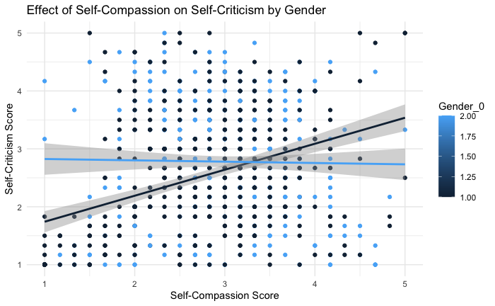

# About Me
Hi! I'm a **second-year student** at the **University of Toronto**, pursuing a **B.Sc. in Psychology and Cognitive Science**. My academic interests lie at the intersection of psychology, cognitive science, and mental health research.

## Education	 			        		
- B.Sc., Psychology and Cognitive Science | The University of Toronto (_May 2026 (Expected)_)

# Projects
### Self-Compassion and Anxiety: A Gender-Dependent Analysis

- Previous research has shown that self-compassion can reduce anxiety by alleviating self-criticism, but limited research explores whether gender moderates this effect (Einstein et al., 2022).
- Inspired by these questions, I investigated how self-compassion impacts anxiety in high school students and whether gender moderates this relationship.
- I used data collected by Einstein and colleagues: 
  - (_916 participants ages 12-16_)
  - (_Measures included the Self-Compassion Scale (Raes et al., 2011) and Spence Children’s Anxiety Scale_)
  - [dataset](https://figshare.mq.edu.au/articles/dataset/Abbreviated_FOMO_and_social_media_dataset/20188298/1?file=36091265)

I analyzed these relationships using moderation analysis:
  - [data analysis code](https://github.com/nehirarpat/Research/blob/main/code.md)

- The relationship between self-compassion and anxiety levels revealed a complex, gender-dependent pattern.
- For males, higher levels of self-compassion were associated with an increase in anxiety, contrary to the expected protective effect.
  - This surprising outcome was explained by the role of self-criticism: as self-compassion increased, so did self-criticism, suggesting that        males may interpret self-compassion in a way that exacerbates their internal self-evaluative tendencies.
- For females, no significant relationship was found between self-compassion and anxiety. Additionally, self-compassion had no measurable impact on self-criticism in this group.
  
- These findings highlight an important gender difference in how self-compassion operates and suggest that the mechanisms underlying its effects may vary based on gender. Overall, the results challenge the assumption that self-compassion universally reduces anxiety.
- Instead, they underscore the need for tailored interventions that account for gender-specific responses to self-compassion practices. For males, approaches that address the link between self-compassion and self-criticism may be particularly important to ensure its beneficial effects.
